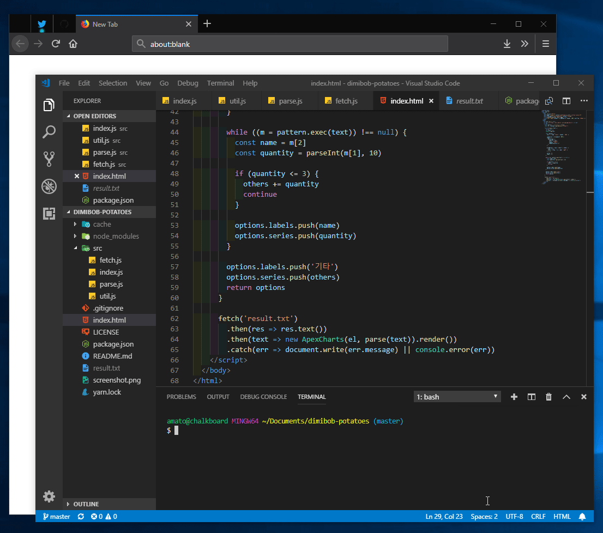

# dimibob-potatoes

역대 [디미고](https://dimigo.hs.kr) 급식에서 [감자가 들어간 메뉴](https://gist.github.com/ChalkPE/78c9a4899b91e13045115ba14bacb333)를 전부 찾아줍니다.

## 사용법

```bash
git clone https://github.com/ChalkPE/dimibob-potatoes
cd dimibob-potatoes && yarn && yarn start && cat result.txt
```

## 스크린샷



## 라이선스

[MIT](LICENSE) 라이선스입니다!